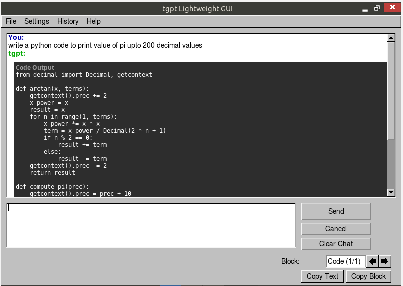

# tgpt GUI



A lightweight, high-performance Graphical User Interface for the `tgpt` terminal tool. This application provides a streaming "typing" effect, chat history management, and is specifically optimized for legacy hardware and low-resource environments.

## Supported Systems

This application is designed to run on almost any Linux distribution featuring the X Window System. It is primarily optimized for lightweight and legacy distributions like **AntiX Linux**, but works flawlessly on Ubuntu, Debian, Arch Linux, Linux Mint, and others.

## Prerequisites

The installation script will automatically handle most prerequisites, but ensures you have internet access. The following components are required and will be installed if missing:

- `curl` (to fetch the tgpt backend)
- `tgpt` (the terminal AI backend)
- `build-essential` (for compiling C++ code)
- `libfltk1.3-dev` (FLTK library for the GUI interface)
- `xclip` (for clipboard support)

## Installation & Compilation

### Standalone Installation (Recommended)

You can easily install `tgpt-gui` in one step using the standalone setup script without manually cloning the repository. Run the following command in your terminal:

```bash
curl -sSL https://raw.githubusercontent.com/gautamjangid/tgpt-gui/main/scripts/setup.sh | bash
```

### Manual Repository Installation

Alternatively, you can clone the repository and run the internal installer script which handles dependencies and compilation:

1. Navigate to the project root directory.
2. Give the installation script executable permissions:
   ```bash
   chmod +x scripts/install.sh
   ```
3. Run the script:
   ```bash
   ./scripts/install.sh
   ```

## Manual Compilation (Optional)

If you prefer to compile the application manually without the installer, ensure you have the prerequisites installed, then run the following compilation command from the `scripts` directory:

```bash
g++ -std=c++14 -O2 ../src/main.cpp -o tgpt-gui $(fltk-config --cxxflags --ldflags) -pthread
```

## Usage

Once installed, you can launch the application by:
1. Finding "**tgpt GUI**" in your application menu/launcher.
2. Or by running the following command in your terminal:
   ```bash
   tgpt-gui
   ```

### Copy Functionality
The application's **Copy Selected** button at the bottom provides a seamless dual-action mode:
- **Highlighted Text:** If you manually highlight any text in the chat view with your mouse, clicking the button instantly copies that selection to your clipboard (equivalent to pressing `Ctrl+C`).
- **Code Blocks:** If nothing is selected, you can use the arrow buttons to cycle through all recognized backend code blocks in the current view and copy them natively with a single click.

## How to use tgpt-cli Settings

`tgpt-gui` provides an integrated interface to configure the underlying AI runtime natively directly from the GUI (found under **Settings -> tgpt-cli**).

*   **Provider:** Determines which backend service handles your chat queries. Free providers (such as `duckduckgo`, `phind`, `ollama`) are immediately accessible and require no extra setup. If you select one of these, the Model and API Key inputs will deactivate since they aren't needed.
*   **Model:** Specifies the exact neural network to query. This is typically only required if you use a top-tier provider like `openai`.
*   **API Key:** An authenticated token required for premium endpoints like OpenAI or Anthropic. Leave this empty if you are using free providers.
*   **Extra Args:** Space-separated CLI flags passed directly to tgpt. Supports `-c` and `-s` flags (see Advanced CLI Modes below).

*(Hint: If you're unsure where to begin, simply leave all settings blank to default securely to the baseline free provider!)*

## Advanced CLI Modes

tgpt-gui fully supports tgpt's advanced CLI modes. Set these flags in **Settings → tgpt-cli → Extra Args**.

### Code Mode (`-c`)

Optimized for generating code. Output is rendered in a dark-themed code block with **preserved indentation and whitespace**.

```
Extra Args: -c
Prompt: "write python code to draw a circle"
```

The generated code will appear in a styled `<pre>` block instead of being treated as markdown.

### Shell Mode (`-s`)

Generates shell commands from natural language. When tgpt suggests a command, a **popup dialog** will appear showing the command and asking for confirmation.

```
Extra Args: -s
Prompt: "list all files in current directory"
```

- If you click **Yes**: the command executes immediately and the output is displayed directly in the chat window.
- If you click **No**: the command is not executed and a notification appears in the chat.

**How it works:**
1. You ask a question like "how to update my system?"
2. tgpt generates a suggested command
3. A popup dialog appears showing the command with **Yes**/**No** buttons
4. On **Yes**: The command runs and output appears in chat
5. On **No**: Command is skipped

> **Note:** Only `-c` (code mode) and `-s` (shell mode) are supported in Extra Args. The `-i` (interactive) and `-is` (interactive shell) modes use bubbletea — a TUI framework that requires a real PTY with raw mode and cursor control. This is fundamentally incompatible with GUI-based process piping and is therefore not supported.

## Supported Modes

The tgpt GUI supports several command-line modes that can be enabled through the Settings dialog:

### -c (Code Mode)
Outputs responses in formatted, copyable code blocks. Ideal for programming-related queries.

### -s (Shell Mode)
Suggests shell commands with a Yes/No confirmation dialog before execution. Great for system administration tasks.

### -f (Search Mode)
Enables web search functionality via Google Custom Search API. Requires environment variables:
- `TGPT_GOOGLE_API_KEY`
- `TGPT_GOOGLE_SEARCH_ENGINE_ID`

To set these variables:
1. Get a Google API key from Google Cloud Console
2. Enable the Custom Search API
3. Create a Custom Search Engine and get its ID
4. Add to your shell profile (e.g., ~/.bashrc):
   ```bash
   export TGPT_GOOGLE_API_KEY=your_api_key_here
   export TGPT_GOOGLE_SEARCH_ENGINE_ID=your_search_engine_id_here
   ```
5. Restart the application

### -q (Quiet Mode)
Suppresses progress spinners and other verbose output for cleaner responses.

## Unsupported Modes

The following interactive modes are not supported in the GUI due to incompatibility with GUI process piping:
- `-i` (Interactive Mode)
- `-is` (Interactive Shell Mode)

These modes use bubbletea's raw PTY which conflicts with the GUI's stdin/stdout handling.


## Uninstallation

To completely remove the application and its dependencies, run the provided uninstaller script:

```bash
chmod +x scripts/uninstall.sh
./scripts/uninstall.sh
```

You'll be prompted to optionally clear out chat history (`~/.tgpt-gui`) and remove underlying dependencies (like FLTK or the core `tgpt` CLI) if you don't use them anywhere else within your system.
